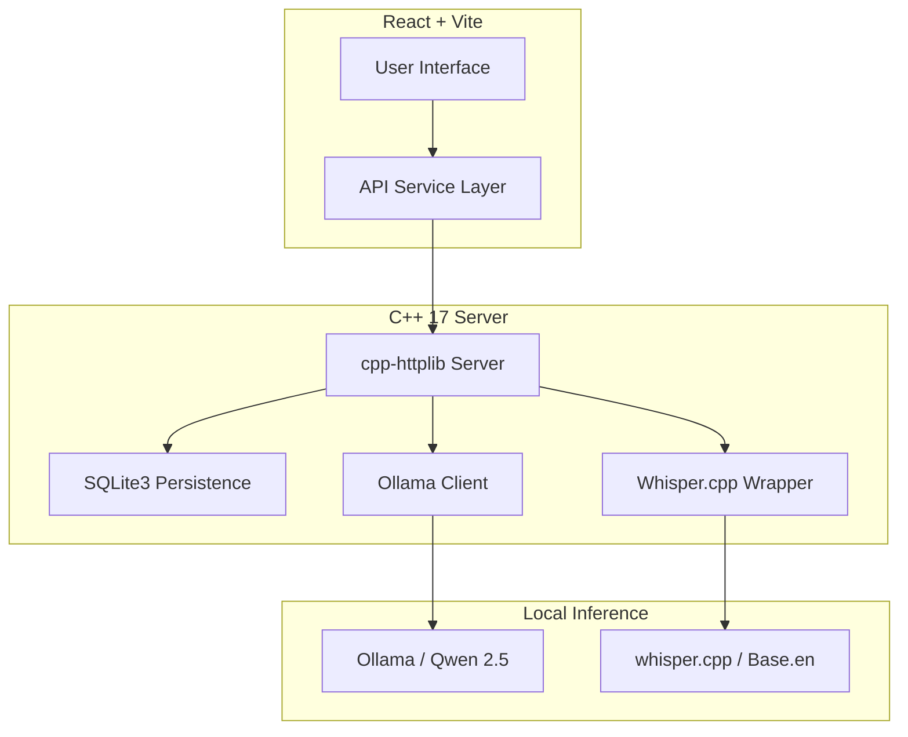

# AI Study Suite

<div align="center">
  
  
  
  
</div>

**AI Study Suite** is a professional, high-performance note-taking ecosystem designed for students and researchers who prioritize **privacy**, **speed**, and **ownership**. By leveraging a local C++ backend and on-device LLMs, it provides powerful AI augmentation without a single byte of your data ever leaving your machine.

---

## Why AI Study Suite?

In an era of cloud-based AI, privacy is often traded for convenience. AI Study Suite restores that balance:

- **100% Offline**: No internet connection required. No cloud API keys. No monthly subscriptions.
- **Zero Data Leakage**: Your notes, voice recordings, and prompts stay on your hardware.
- **Hyper-Fast**: A specialized C++ backend ensures minimal overhead between you and your local AI.
- **Free Forever**: Powered by open-weights models (Qwen 2.5) and open-source engines (Ollama, whisper.cpp).

---

## Key Features

- **Smart Enhance**: Transform messy, fragmented lecture notes into structured, professional study guides with academic Markdown formatting.
- **Streaming AI**: Experience real-time generation. AI enhancements stream token-by-token directly into your editor for an instant, responsive feel.
- **Voice-to-Note**: Capture ideas instantly. Record audio and transcribe it locally using `whisper.cpp`, then automatically enhance the result.
- **Auto-Bullet**: Instantly convert long-form paragraphs into organized, scannable bullet points.
- **Quiz Mode**: Turn your notes into a self-test. The AI generates multiple-choice questions to verify your understanding.
- **Simplify**: Stuck on a complex topic? The "Explain Like I'm 5" mode breaks down technical jargon into simple analogies.
- **Markdown Export**: Seamlessly export your polished notes into professional `.md` files for use in Obsidian, Notion, or other editors.
- **Transparency Tools**:
  - **Diff View**: Compare original and enhanced text side-by-side.
  - **Latency Tracking**: Real-time monitoring of local inference speeds.
  - **Health Banner**: Instant status of your local AI and Speech engines.

---

## Architecture



---

## Tech Stack

| Layer | Technology | Purpose |
| :--- | :--- | :--- |
| **Frontend** | React, Vite, Tailwind CSS | Fast, responsive, modern UI |
| **Backend** | C++ 17, cpp-httplib | High-efficiency networking & orchestration |
| **Database** | SQLite3 (Amalgamation) | Private, zero-config local persistence |
| **LLM** | Ollama (Qwen 2.5) | Local reasoning and text generation |
| **STT** | whisper.cpp | Local speech-to-text transcription |
| **Data** | nlohmann/json | Seamless C++/JS communication |
| **CI/CD** | GitHub Actions | Automated build and test verification |

---

## Installation & Setup

### 1. AI Engine (Ollama)
1. Download and install [Ollama](https://ollama.com/).
2. Pull the required model:
   ```bash
   ollama run qwen2.5
   ```

### 2. Speech Engine (whisper.cpp)
1. Clone and build [whisper.cpp](https://github.com/ggerganov/whisper.cpp).
2. Place the compiled `main` binary as `whisper` in the `backend/` directory.
3. Download a model (e.g., `ggml-base.en.bin`) and place it in `backend/models/ggml-base.en.bin`.

### 3. C++ Backend
**Windows (MSVC):**
1. Open the "Developer Command Prompt for VS 2022".
2. Run:
   ```bash
   cd backend
   mkdir build && cd build
   cmake ..
   cmake --build .
   Debug\ai_notes_server.exe
   ```

**Linux/macOS:**
```bash
cd backend
mkdir build && cd build
cmake ..
make
./ai_notes_server
```

### 4. React Frontend
```bash
cd frontend
npm install
npm run dev
```

---

## Roadmap

- [ ] **PDF Export**: Export polished study guides to high-quality PDFs.
- [ ] **Spaced Repetition**: Turn Quiz Mode into an Anki-style flashcard system.
- [ ] **Local RAG**: Query across multiple notes using local embeddings.
- [ ] **Markdown Storage**: Support for portable `.md` file syncing.

---

## Contributing

Contributions are welcome! Please see [CONTRIBUTING.md](CONTRIBUTING.md) for our development workflow and [CODE_OF_CONDUCT.md](CODE_OF_CONDUCT.md) for community guidelines.

## License
Distributed under the MIT License. See `LICENSE` for more information.
