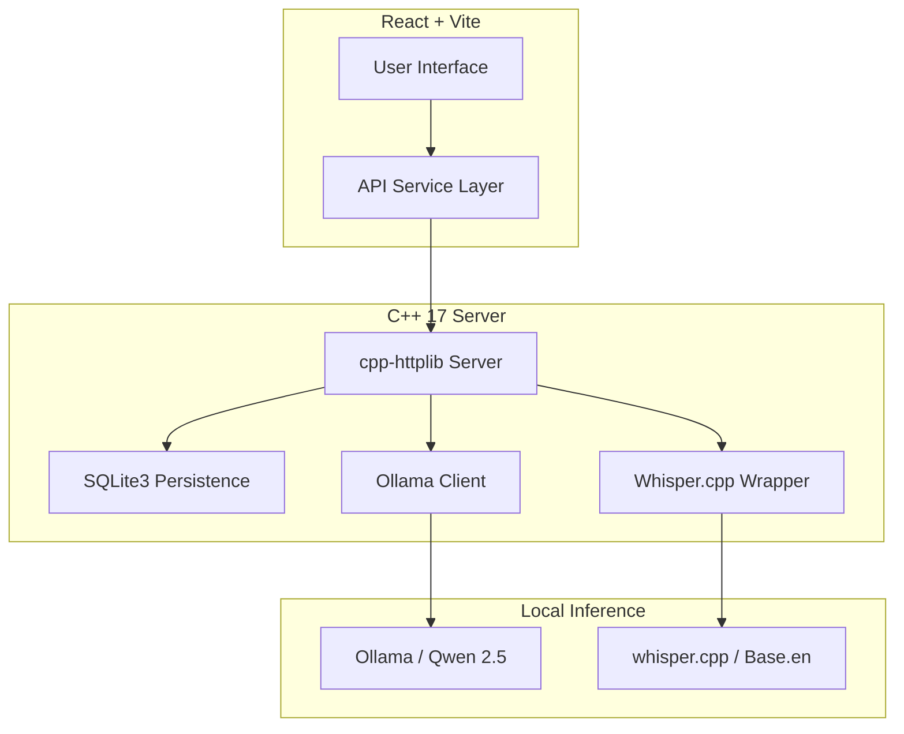

# AI Study Suite

A privacy-first, offline AI note-taking application that leverages local LLM inference and speech-to-text for secure, on-device study augmentation.

<div align="center">
  
  
  
  
</div>

## Overview

AI Study Suite is designed for users who require powerful AI tools without compromising data privacy. The application runs entirely on the local machine, utilizing a C++ backend for high-efficiency orchestration and an on-device LLM (Qwen 2.5 via Ollama) for text generation.

### Core Engineering Goals
- **Zero Data Exfiltration**: All processing happens locally. No cloud APIs or internet connectivity are required for core functionality.
- **Minimal Overhead**: A specialized C++ server manages the lifecycle of notes, handles transcription, and proxies requests to local AI engines.
- **End-to-End Privacy**: Local SQLite storage ensures total ownership of user data.

---

## Key Features

- **AI Note Enhancement**: Rewrites fragmented notes into structured study guides using academic Markdown.
- **Real-time Streaming**: Implements NDJSON streaming from the backend to the React UI for an instant, responsive AI experience.
- **Local Voice-to-Note**: Integrates `whisper.cpp` for local speech-to-text transcription, allowing for seamless audio capture and automatic AI enhancement.
- **Specialized AI Modes**:
  - **Auto-Bullet**: Converts long-form text into scannable bullet points.
  - **Quiz Generation**: Generates multiple-choice questions based on note content to facilitate active recall.
  - **Simplification**: Uses "Explain Like I'm 5" prompts to break down complex technical jargon.
- **Persistence & Export**: Local SQLite database for storage with a dedicated Markdown export utility.

---

## Screenshots

*(Add your captures here)*
- **Main Workspace**: [Capture showing the editor, sidebar, and health banner]
- **Smart Enhance**: [GIF of text streaming into the suggestion panel]
- **Quiz Mode**: [Capture of AI-generated multiple-choice questions]
- **Voice-to-Note**: [GIF of recording audio and seeing the transcription appear]

---

## Architecture



## Tech Stack

| Layer | Technology | Purpose |
| :--- | :--- | :--- |
| **Frontend** | React, Vite, Tailwind CSS | UI/UX and state management |
| **Backend** | C++ 17, cpp-httplib | Networking and orchestration |
| **Database** | SQLite3 | Local, file-based persistence |
| **LLM** | Ollama (Qwen 2.5) | Local reasoning and generation |
| **STT** | whisper.cpp | Local speech-to-text |
| **Data** | nlohmann/json | Inter-process communication |
| **CI/CD** | GitHub Actions | Build and test automation |

---

## Installation & Setup

### 🚀 Quick Start (Desktop App)
1. **Setup**: Run `./setup_app.bat` to install dependencies and build the core.
2. **Launch**: Run `./run_app.bat` to start the application.

### Detailed Setup

#### 1. AI Engine (Ollama)
1. Install [Ollama](https://ollama.com/).
2. Pull the model: `ollama run qwen2.5`.

#### 2. Speech Engine (whisper.cpp)
1. Clone and build [whisper.cpp](https://github.com/ggerganov/whisper.cpp).
2. Place the `main` binary as `whisper` in the `backend/` directory.
3. Place the model (e.g., `ggml-base.en.bin`) in `backend/models/ggml-base.en.bin`.

#### 3. C++ Backend
**Windows (MSVC):**
```bash
cd backend
mkdir build && cd build
cmake ..
cmake --build .
Debug\ai_notes_server.exe
```

**Linux/macOS:**
```bash
cd backend
mkdir build && cd build
cmake ..
make
./ai_notes_server
```

#### 4. React Frontend
```bash
cd frontend
npm install
npm run dev
```

---

## Roadmap
- [ ] **PDF Export**: Generate high-quality PDFs from study guides.
- [ ] **Spaced Repetition**: Integration of an Anki-style flashcard system.
- [ ] **Local RAG**: Local embedding-based search across notes.
- [ ] **Markdown Sync**: Support for portable `.md` file syncing.

## Contributing
Contributions are welcome! Please see [CONTRIBUTING.md](CONTRIBUTING.md) for details.

## License
Distributed under the MIT License. See `LICENSE` for more information.
